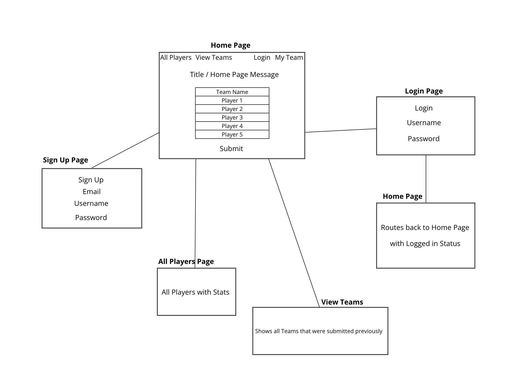

# nbafantasyteam

# NBA Fantasy Team

## Introduction

Welcome to the NBA Fantasy Team Creator! This app allows you to build your dream starting lineup of five NBA players of your choice. Imagine having the ability to select any player from the league to create the ultimate fantasy team. Whether you're a seasoned basketball enthusiast or just a casual fan, this app provides a fun and interactive way to put together your ideal NBA starting five. 

## Features

- User login credentials with secure password hashing
- Ability to log out 
- Input fantasy team's name and 5 players to be added into the fantasy team
- Edit a player in saved team
- Delete a player in saved team
- Add a player in saved team 
- Delete a saved team
- List of all NBA players in All Players page
- Routes to players stats per hyperlinked player's name

## Installation

- Clone the following repository: ` https://github.com/brianjkim94/nbafantasyteam `
- Install following packages 
    - npm install
    - npm install express
    - npm install express-session
    - npm install method-override
    - npm install axios
    - npm install mongoose
    - npm install mongodb
    - npm install ejs
    - npm install dotenv

## User Stories

Create personal account with own unique username and password 

Login and Log out of account after account setup

Input player's name to add to their fantasy team 

Create, Edit, Delete and Add players of their choice to tailor their fantasy team

## Wireframe

## ERD

User login credentials:
- Username
- Password 
- Email
- Phone Number

NBA Player:
- Name 
- ID
- age 
- height
- weight
- position
- draft
- college

